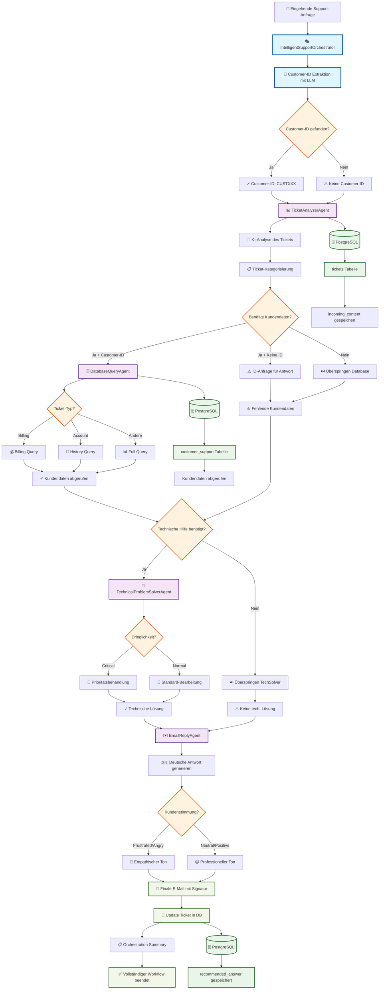
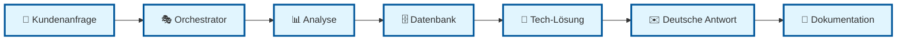
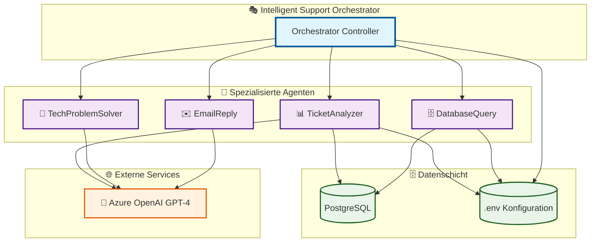
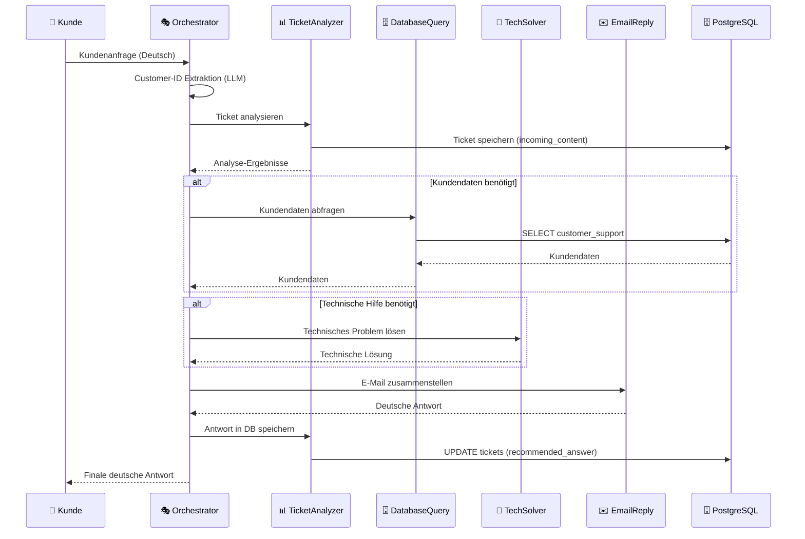
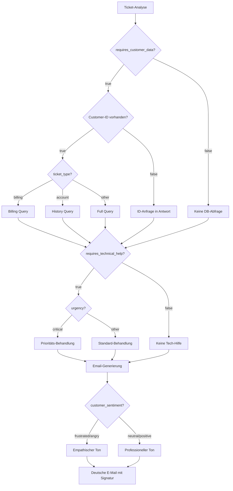

# Mermaid Workflow Chart - Intelligenter Support-Orchestrator

## Kompletter Workflow Mermaid Code

## Vereinfachter Workflow für Präsentationen

## Agent-Architektur Diagramm

## Datenfluss Diagramm

## Routing-Entscheidungsbaum

