# Mermaid Workflow Chart - Intelligenter Support-Orchestrator

## Kompletter Workflow Mermaid Code

```mermaid
graph TD
    A[📧 Eingehende Support-Anfrage] --> B[🎭 IntelligentSupportOrchestrator]
    
    B --> C[🤖 Customer-ID Extraktion mit LLM]
    C --> D{Customer-ID gefunden?}
    D -->|Ja| E[✓ Customer-ID: CUSTXXX]
    D -->|Nein| F[⚠️ Keine Customer-ID]
    
    E --> G[📊 TicketAnalyzerAgent]
    F --> G
    G --> H[🧠 KI-Analyse des Tickets]
    H --> I[📋 Ticket-Kategorisierung]
    
    I --> J{Benötigt Kundendaten?}
    J -->|Ja + Customer-ID| K[🗄️ DatabaseQueryAgent]
    J -->|Ja + Keine ID| L[⚠️ ID-Anfrage für Antwort]
    J -->|Nein| M[⏭️ Überspringen Database]
    
    K --> K1{Ticket-Typ?}
    K1 -->|Billing| K2[💰 Billing Query]
    K1 -->|Account| K3[📜 History Query] 
    K1 -->|Andere| K4[📊 Full Query]
    
    K2 --> N[✓ Kundendaten abgerufen]
    K3 --> N
    K4 --> N
    L --> O[⚠️ Fehlende Kundendaten]
    M --> O
    
    N --> P{Technische Hilfe benötigt?}
    O --> P
    P -->|Ja| Q[🔧 TechnicalProblemSolverAgent]
    P -->|Nein| R[⏭️ Überspringen TechSolver]
    
    Q --> Q1{Dringlichkeit?}
    Q1 -->|Critical| Q2[🚨 Prioritätsbehandlung]
    Q1 -->|Normal| Q3[📝 Standard-Bearbeitung]
    Q2 --> S[✓ Technische Lösung]
    Q3 --> S
    R --> T[⚠️ Keine tech. Lösung]
    
    S --> U[✉️ EmailReplyAgent]
    T --> U
    U --> V[🇩🇪 Deutsche Antwort generieren]
    V --> W{Kundenstimmung?}
    W -->|Frustrated/Angry| X[💝 Empathischer Ton]
    W -->|Neutral/Positive| Y[😊 Professioneller Ton]
    
    X --> Z[📧 Finale E-Mail mit Signatur]
    Y --> Z
    Z --> AA[💾 Update Ticket in DB]
    AA --> BB[📋 Orchestration Summary]
    
    BB --> CC[✅ Vollständiger Workflow beendet]
    
    %% Database Operations
    G --> DB1[(🗄️ PostgreSQL)]
    DB1 --> DB2[tickets Tabelle]
    DB2 --> DB3[incoming_content gespeichert]
    
    K --> DB4[(🗄️ PostgreSQL)]
    DB4 --> DB5[customer_support Tabelle]
    DB5 --> DB6[Kundendaten abgerufen]
    
    AA --> DB7[(🗄️ PostgreSQL)]
    DB7 --> DB8[recommended_answer gespeichert]
    
    %% Styling
    classDef orchestrator fill:#e1f5fe,stroke:#01579b,stroke-width:3px
    classDef agent fill:#f3e5f5,stroke:#4a148c,stroke-width:2px
    classDef database fill:#e8f5e8,stroke:#1b5e20,stroke-width:2px
    classDef decision fill:#fff3e0,stroke:#e65100,stroke-width:2px
    classDef output fill:#f1f8e9,stroke:#33691e,stroke-width:2px
    
    class B,C orchestrator
    class G,K,Q,U agent
    class DB1,DB4,DB7,DB2,DB5,DB8 database
    class D,J,P,K1,Q1,W decision
    class CC,Z,AA output
```

## Vereinfachter Workflow für Präsentationen

```mermaid
graph LR
    A[📧 Kundenanfrage] --> B[🎭 Orchestrator]
    B --> C[📊 Analyse]
    C --> D[🗄️ Datenbank]
    D --> E[🔧 Tech-Lösung]
    E --> F[✉️ Deutsche Antwort]
    F --> G[💾 Dokumentation]
    
    classDef main fill:#e1f5fe,stroke:#01579b,stroke-width:3px
    class A,B,C,D,E,F,G main
```

## Agent-Architektur Diagramm

```mermaid
graph TB
    subgraph "🎭 Intelligent Support Orchestrator"
        OSC[Orchestrator Controller]
    end
    
    subgraph "🤖 Spezialisierte Agenten"
        TA[📊 TicketAnalyzer]
        DQ[🗄️ DatabaseQuery]
        TP[🔧 TechProblemSolver]
        ER[✉️ EmailReply]
    end
    
    subgraph "🗄️ Datenschicht"
        DB[(PostgreSQL)]
        ENV[(.env Konfiguration)]
    end
    
    subgraph "🌐 Externe Services"
        AI[🧠 Azure OpenAI GPT-4]
    end
    
    OSC --> TA
    OSC --> DQ
    OSC --> TP
    OSC --> ER
    
    TA --> DB
    DQ --> DB
    TA --> AI
    TP --> AI
    ER --> AI
    
    TA --> ENV
    DQ --> ENV
    OSC --> ENV
    
    classDef orchestrator fill:#e1f5fe,stroke:#01579b,stroke-width:3px
    classDef agent fill:#f3e5f5,stroke:#4a148c,stroke-width:2px
    classDef data fill:#e8f5e8,stroke:#1b5e20,stroke-width:2px
    classDef external fill:#fff3e0,stroke:#e65100,stroke-width:2px
    
    class OSC orchestrator
    class TA,DQ,TP,ER agent
    class DB,ENV data
    class AI external
```

## Datenfluss Diagramm

```mermaid
sequenceDiagram
    participant C as 📧 Kunde
    participant O as 🎭 Orchestrator
    participant TA as 📊 TicketAnalyzer
    participant DQ as 🗄️ DatabaseQuery
    participant TP as 🔧 TechSolver
    participant ER as ✉️ EmailReply
    participant DB as 🗄️ PostgreSQL
    
    C->>O: Kundenanfrage (Deutsch)
    O->>O: Customer-ID Extraktion (LLM)
    O->>TA: Ticket analysieren
    TA->>DB: Ticket speichern (incoming_content)
    TA-->>O: Analyse-Ergebnisse
    
    alt Kundendaten benötigt
        O->>DQ: Kundendaten abfragen
        DQ->>DB: SELECT customer_support
        DB-->>DQ: Kundendaten
        DQ-->>O: Kundendaten
    end
    
    alt Technische Hilfe benötigt
        O->>TP: Technisches Problem lösen
        TP-->>O: Technische Lösung
    end
    
    O->>ER: E-Mail zusammenstellen
    ER-->>O: Deutsche Antwort
    O->>TA: Antwort in DB speichern
    TA->>DB: UPDATE tickets (recommended_answer)
    O-->>C: Finale deutsche Antwort
```

## Routing-Entscheidungsbaum

```mermaid
graph TD
    A[Ticket-Analyse] --> B{requires_customer_data?}
    B -->|true| C{Customer-ID vorhanden?}
    B -->|false| D[Keine DB-Abfrage]
    
    C -->|true| E{ticket_type?}
    C -->|false| F[ID-Anfrage in Antwort]
    
    E -->|billing| G[Billing Query]
    E -->|account| H[History Query]
    E -->|other| I[Full Query]
    
    G --> J{requires_technical_help?}
    H --> J
    I --> J
    D --> J
    F --> J
    
    J -->|true| K{urgency?}
    J -->|false| L[Keine Tech-Hilfe]
    
    K -->|critical| M[Prioritäts-Behandlung]
    K -->|other| N[Standard-Behandlung]
    
    M --> O[Email-Generierung]
    N --> O
    L --> O
    
    O --> P{customer_sentiment?}
    P -->|frustrated/angry| Q[Empathischer Ton]
    P -->|neutral/positive| R[Professioneller Ton]
    
    Q --> S[Deutsche E-Mail mit Signatur]
    R --> S
```

